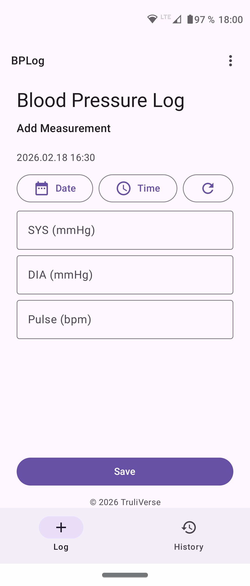
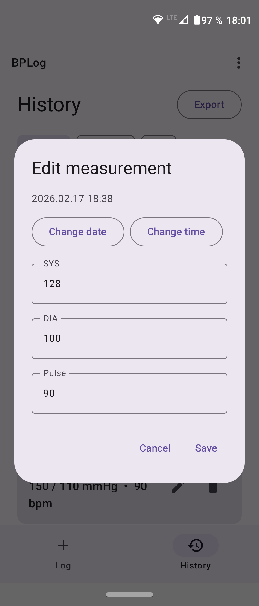
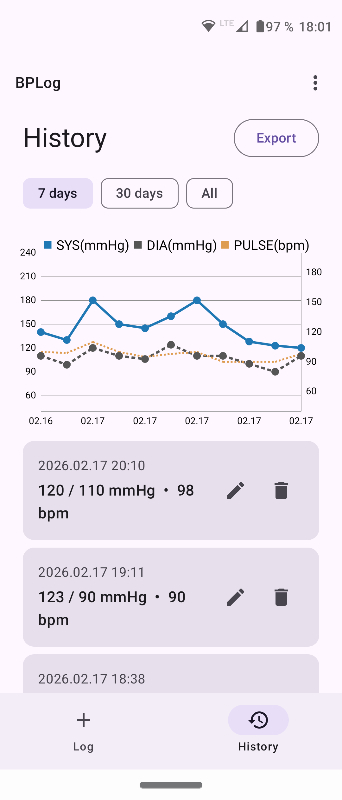
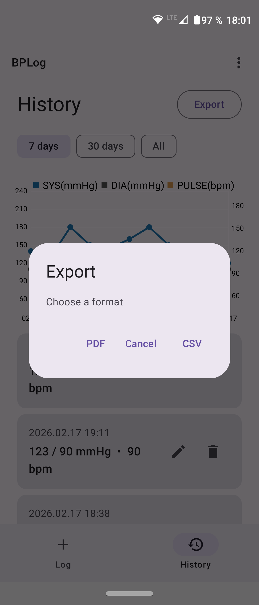
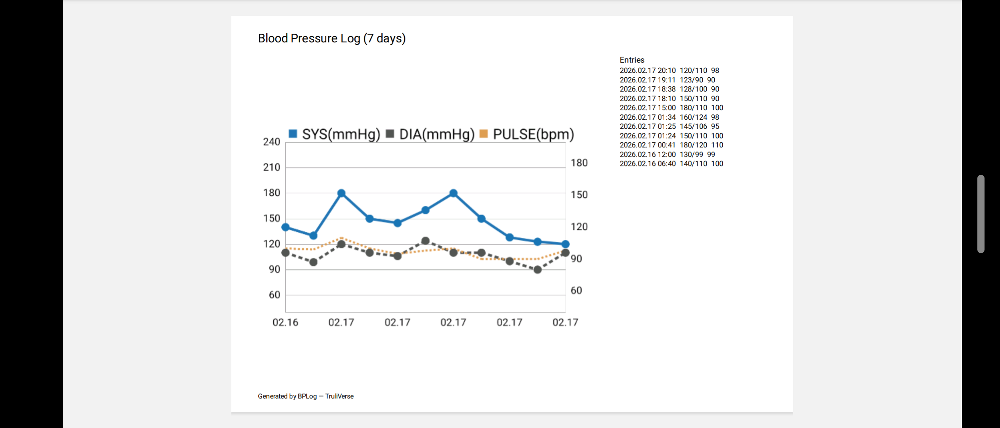
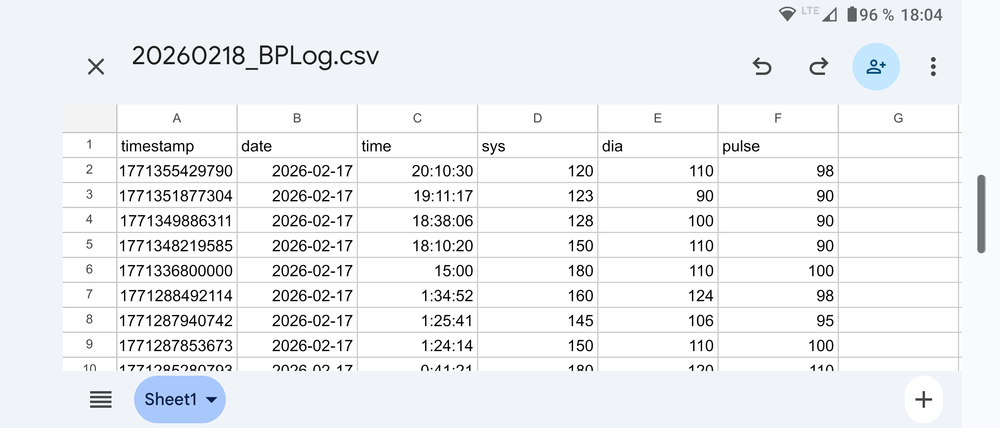

# BP-Log (Android)

A privacy-first blood pressure logger that works completely offline.
No account, no cloud, no analytics. Your data stays on your device.

## Features
- Log blood pressure (systolic / diastolic) and pulse
- History and charts (7 days / 30 days / all time)
- Export measurements to CSV
- Export reports to PDF (including charts)
- Fully offline — no internet connection required

### Screenshots

### Export screenshots

## CSV format

Example:

    timestamp,date,time,systolic,diastolic,pulse 
    1771349886311,2026-02-17,18:38:06.311,128,100,90

Field description:

- `timestamp` — Unix timestamp in milliseconds (UTC)
- `date` — YYYY-MM-DD
- `time` — HH:MM:SS.SSS (24h format)
- `systolic` — mmHg
- `diastolic` — mmHg
- `pulse` — bpm

Date and time fields reflect the device's local time.
Timestamp is stored as Unix epoch milliseconds (UTC).

## Privacy
BP-Log does not collect, store, or transmit personal data.
All measurements remain on your device.

## Medical disclaimer
This app is intended for self-tracking only and does not provide medical advice, diagnosis, or treatment.
Always consult a qualified healthcare professional regarding medical concerns.

## Build
Open the project in Android Studio and run the `app` configuration.

## License
MIT — see [LICENSE](LICENSE).